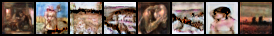

# Progressive CycleGAN

## Overview

This repository implements a **Progressive CycleGAN** for image-to-image translation between the CelebA dataset and Van Gogh paintings. The project leverages progressive growing techniques to enhance the quality and stability of the GAN training process, allowing the model to handle multiple resolutions effectively.

## Accomplishments

- **Implemented Progressive CycleGAN Architecture**: Developed generator and discriminator models that grow progressively, starting from low resolutions and incrementally increasing to higher resolutions.
- **Custom Data Loaders**: Created tailored data loaders for the CelebA and Van Gogh datasets, accommodating both flat and nested directory structures.
- **Multi-Resolution Training**: Set up a training pipeline that handles multiple resolutions, enabling the model to learn coarse to fine details progressively.
- **Checkpointing Mechanism**: Developed a system to save model states and optimizers at various training stages, facilitating easy resumption and analysis.

## Implementation Details

### Data Loading

- **CelebA Dataset**: Utilizes a flat directory structure. Images are loaded and transformed based on the current resolution during training.
- **Van Gogh Dataset**: Handles nested directories recursively to gather all image files. This ensures comprehensive coverage of Van Gogh's paintings.

```python
class ImageDataset(Dataset):
    def __init__(self, root, transform=None, is_celeba=True):
        # Initialization code
```

### Progressive Generator and Discriminator

- **ProgressiveGenerator**: Builds the generator model in blocks, each corresponding to a specific resolution. Each block consists of convolutional layers that increase the model's capacity as the resolution grows.

```python
class ProgressiveGenerator(nn.Module):
    def __init__(self, num_blocks):
        # Generator initialization
```

- **ProgressiveDiscriminator**: Mirrors the generator's progressive structure, with layers designed to discriminate images at various resolutions effectively.

```python
class ProgressiveDiscriminator(nn.Module):
    def __init__(self, num_blocks):
        # Discriminator initialization
```

### Training Configuration

- **Device Setup**: Automatically selects the best available device (MPS, CUDA, or CPU) for training.
- **Loss Functions**: Utilizes GAN loss, cycle consistency loss, and identity loss to ensure robust training.
- **Optimizers**: Employs Adam optimizers with specific learning rates and betas for different parts of the model.

```python
device = torch.device('mps' if torch.backends.mps.is_available() else 'cuda' if torch.cuda.is_available() else 'cpu')
criterion_GAN = nn.MSELoss()
optimizer_G = optim.Adam(...)
```

### Checkpointing

Implemented a checkpointing function to save the state of models and optimizers at each training step and epoch. This ensures that training can be resumed seamlessly and allows for evaluation at different stages.

```python
def save_checkpoint(step, epoch, models, optimizers, save_dir='checkpoints'):
    # Checkpoint saving code
```

## Training Process

The training follows a progressive approach, starting from low resolutions (e.g., 4x4) and moving to higher ones (e.g., 256x256). At each stage, the model is trained for a specified number of epochs before increasing the resolution. This method stabilizes training and improves the quality of generated images.

> **Note**: The training loop is currently commented out and can be activated as needed.

## Results

Sample images generated at various resolutions can be found in the `images` directory:

<div style="display: flex; flex-direction: column; gap: 20px;">
    <div style="display: flex; gap: 10px;">
        
    </div>
    <div style="display: flex; gap: 10px;">
        
    </div>
    <div style="display: flex; gap: 10px;">
        
    </div>
    <div style="display: flex; gap: 10px;">
        
    </div>
    <div style="display: flex; gap: 10px;">
        
    </div>
    <div style="display: flex; gap: 10px;">
        
    </div>
</div>


And here are the images the other way around


<div style="display: flex; flex-direction: column; gap: 20px;">
    <div style="display: flex; gap: 10px;">
        
    </div>
    <div style="display: flex; gap: 10px;">
        
    </div>
    <div style="display: flex; gap: 10px;">
        
    </div>
    <div style="display: flex; gap: 10px;">
        
    </div>
    <div style="display: flex; gap: 10px;">
        
    </div>
    <div style="display: flex; gap: 10px;">
        
    </div>
</div>

## Acknowledgements

Heavily relied on these papers and their accompanying github repos :D

- [CycleGAN](https://github.com/junyanz/CycleGAN)
- [Progressive GAN](https://github.com/tkarras/progressive_growing_of_gans)
